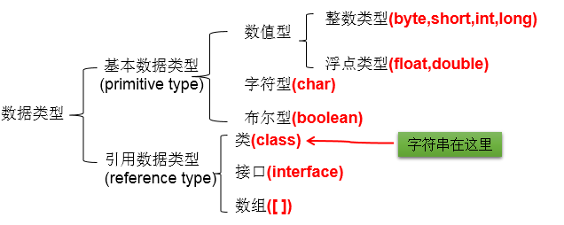
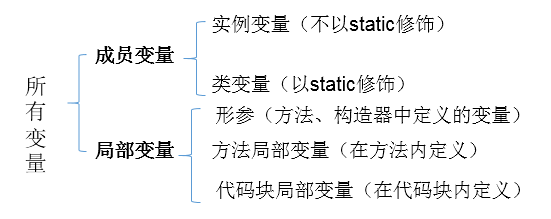

# 1.变量的分类
## 1.1 按数据类型分类

**详细说明：**
* 1. 整型：byte(1字节=8bit) \ short(2字节) \ int(4字节) \ long(8字节)
		>① byte范围：-128 ~ 127
		>
	  >② 声明long型变量，必须以"l"或"L"结尾
	  >
		>③ 通常，定义整型变量时，使用int型。
		>
		>④整型的常量，默认类型是：int型
* 2. 浮点型：float(4字节) \ double(8字节)
		>① 浮点型，表示带小数点的数值
		>
		>② float表示数值的范围比long还大
		>
	  >③ 定义float类型变量时，变量要以"f"或"F"结尾
	  >
	  >④ 通常，定义浮点型变量时，使用double型。
	  >
	  >⑤ 浮点型的常量，默认类型为：double
* 3. 字符型：char (1字符=2字节)
		>① 定义char型变量，通常使用一对'',内部只能写一个字符
		>
	  >② 表示方式：1.声明一个字符 2.转义字符 3.直接使用 Unicode 值来表示字符型常量
* 4. 布尔型：boolean

	 >① 只能取两个值之一：true 、 false
	 >
	 >② 常常在条件判断、循环结构中使用
## 1.2 按声明的位置分类(了解)

# 2.定义变量的格式：
>数据类型  变量名 = 变量值;
>
或
>数据类型  变量名;

>变量名 = 变量值;

# 3.变量使用的注意点：
   >① 变量必须先声明，后使用
   >
   >② 变量都定义在其作用域内。在作用域内，它是有效的。换句话说，出了作用域，就失效了
   >
   >③ 同一个作用域内，不可以声明两个同名的变量
# 4.基本数据类型变量间运算规则
## 4.1 涉及到的基本数据类型：除了boolean之外的其他7种
## 4.2 自动类型转换(只涉及7种基本数据类型）
* 结论：当容量小的数据类型的变量与容量大的数据类型的变量做运算时，结果自动提升为容量大的数据类型。
	>byte 、char 、short --> int --> long --> float --> double 
	>
	>特别的：当byte、char、short三种类型的变量做运算时，结果为int型
	>
        说明：此时的容量大小指的是，表示数的范围的大和小。比如：float容量要大于long的容量

## 4.3 强制类型转换(只涉及7种基本数据类型）：自动类型提升运算的逆运算。
   >1.需要使用强转符：()
   >
   >2.注意点：强制类型转换，可能导致精度损失。
## 4.4 String与8种基本数据类型间的运算
   >1. String属于引用数据类型,翻译为：字符串
   >2. 声明String类型变量时，使用一对""
   >3. String可以和8种基本数据类型变量做运算，且运算只能是连接运算：+
   >4. 运算的结果仍然是String类型
   
       避免：
       String s = 123;//编译错误
       String s1 = "123";
       int i = (int)s1;//编译错误

