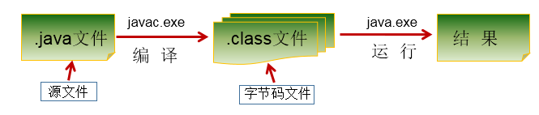
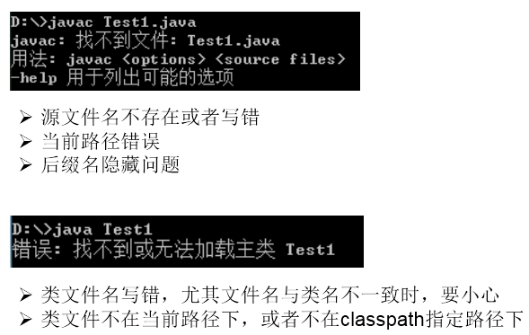
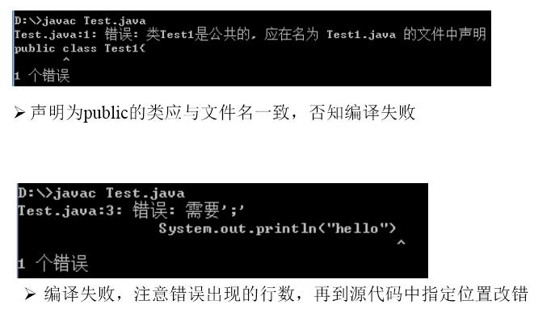

## 1.开发体验——HelloWorld



### 1.1 编写

创建一个java源文件：HelloWorld.java

```java
class HelloChina{
	public static void main(String[] args){
		System.out.println("Hello,World!");
	}
}
```


### 1.2 编译：

```bash
javac HelloWorld.java
```

### 1.3 运行：

```bash
java HelloChina
```

## 2.常见问题的解决





## 3.总结第一个程序

* java程序编写-编译-运行的过程

    > 编写：我们将编写的java代码保存在以".java"结尾的源文件中
    > 编译：使用javac.exe命令编译我们的java源文件。格式：javac 源文件名.java
    > 运行：使用java.exe命令解释运行我们的字节码文件。 格式：java 类名

* 在一个java源文件中可以声明多个class。但是，只能最多有一个类声明为public的。
  而且要求声明为public的类的类名必须与源文件名相同。

* 程序的入口是main()方法。格式是固定的。
* 输出语句：
   > System.out.println():先输出数据，然后换行
   > System.out.print():只输出数据
   > 每一行执行语句都以";"结束。
   > 编译的过程：编译以后，会生成一个或多个字节码文件。字节码文件的文件名与java源文件中的类名相同。
