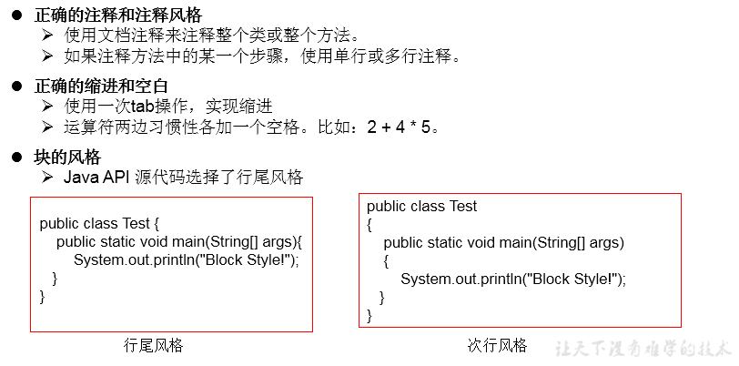

# 1.注释:Comment
#### 分类：
```java
  单行注释：//
  多行注释：/*    */
  文档注释：/**    */
 ```
#### 作用：
>① 对所写的程序进行解释说明，增强可读性。方便自己，方便别人
>
>② 调试所写的代码


#### 特点：
>①单行注释和多行注释，注释了的内容不参与编译。
  换句话说，编译以后生成的.class结尾的字节码文件中不包含注释掉的信息
  
>② 注释内容可以被JDK提供的工具 javadoc 所解析，生成一套以网页文件形式体现的该程序的说明文档。
>
>③ 多行注释不可以嵌套使用
# 2.Java API 文档：　
>API:application programming interface。习惯上：将语言提供的类库，都称为api.
>
>API文档：针对于提供的类库如何使用，给的一个说明书。类似于《新华字典》
>
# 3.良好的编程风格



