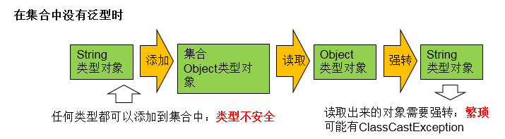
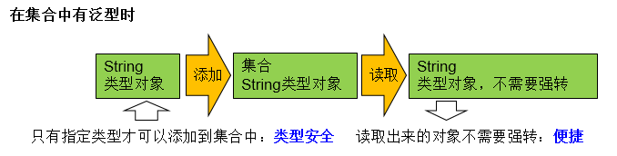

# 泛型的理解

**1.泛型的概念**

所谓泛型，就是允许在定义类、接口时通过一个标识表示类中某个属性的类型或者是某个方法的返回值及参数类型。这个类型参数将在使用时（例如，继承或实现这个接口，用这个类型声明变量、
创建对象时确定（即传入实际的类型参数，也称为类型实参）。

**2.泛型的引入背景**

集合容器类在设计阶段/声明阶段不能确定这个容器到底实际存的是什么类型的对象，所以在JDK1.5之前只能把元素类型设计为Object，JDK1.5之后使用泛型来解决。因为这个时候除了元素的类型不确定，
其他的部分是确定的，例如关于这个元素如何保存，如何管理等是确定的，因此此时把元素的类型设计成一个参数，这个类型参数叫做泛型。Collection<E>，List<E>，ArrayList<E>这个<E>就是类型参数，
即泛型。


# 泛型在集合中的使用
**1. 在集合中使用泛型之前的例子**

```java
@Test
    public void test1(){
        ArrayList list = new ArrayList();
        //需求：存放学生的成绩
        list.add(78);
        list.add(76);
        list.add(89);
        list.add(88);
        //问题一：类型不安全
//        list.add("Tom");

        for(Object score : list){
            //问题二：强转时，可能出现ClassCastException
            int stuScore = (Integer) score;

            System.out.println(stuScore);

        }

    }
```
图示：



**2. 在集合中使用泛型例子1**
```java
@Test
public void test2(){
   ArrayList<Integer> list =  new ArrayList<Integer>();

    list.add(78);
    list.add(87);
    list.add(99);
    list.add(65);
    //编译时，就会进行类型检查，保证数据的安全
//        list.add("Tom");

    //方式一：
//        for(Integer score : list){
//            //避免了强转操作
//            int stuScore = score;
//
//            System.out.println(stuScore);
//
//        }
    //方式二：
    Iterator<Integer> iterator = list.iterator();
    while(iterator.hasNext()){
        int stuScore = iterator.next();
        System.out.println(stuScore);
    }

}
```
    

图示：

  


**3. 在集合中使用泛型例子2**
  
```java
//在集合中使用泛型的情况：以HashMap为例
@Test
public void test3(){
//        Map<String,Integer> map = new HashMap<String,Integer>();
    //jdk7新特性：类型推断
    Map<String,Integer> map = new HashMap<>();

    map.put("Tom",87);
    map.put("Jerry",87);
    map.put("Jack",67);

//        map.put(123,"ABC");
    //泛型的嵌套
    Set<Map.Entry<String,Integer>> entry = map.entrySet();
    Iterator<Map.Entry<String, Integer>> iterator = entry.iterator();

    while(iterator.hasNext()){
        Map.Entry<String, Integer> e = iterator.next();
        String key = e.getKey();
        Integer value = e.getValue();
        System.out.println(key + "----" + value);
    }

}
```

**4. 集合中使用泛型总结：**
  
* ① 集合接口或集合类在jdk5.0时都修改为带泛型的结构。
* ② 在实例化集合类时，可以指明具体的泛型类型
* ③ 指明完以后，在集合类或接口中凡是定义类或接口时，内部结构（比如：方法、构造器、属性等）使用到类的泛型的位置，都指定为实例化的泛型类型。
      比如：add(E e)  --->实例化以后：add(Integer e)
* ④ 注意点：泛型的类型必须是类，不能是基本数据类型。需要用到基本数据类型的位置，拿包装类替换
* ⑤ 如果实例化时，没指明泛型的类型。默认类型为java.lang.Object类型。


