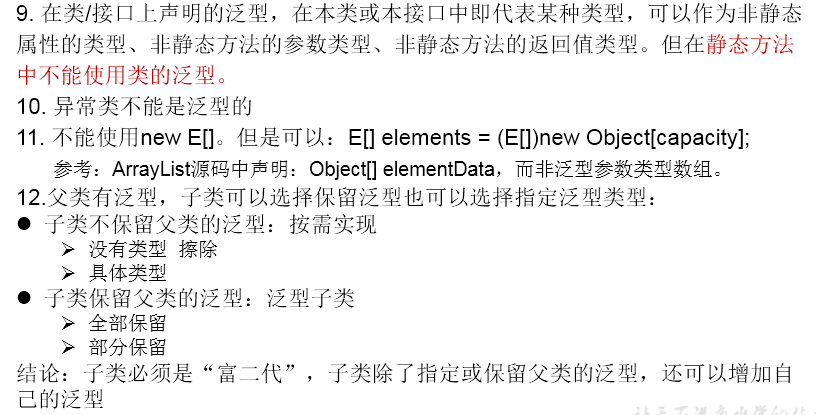

# 自定义泛型类、泛型接口、泛型方法

## 1.举例:
**【Order.java】**
```java
public class Order<T> {

    String orderName;
    int orderId;

    //类的内部结构就可以使用类的泛型

    T orderT;

    public Order(){
        //编译不通过
//        T[] arr = new T[10];
        //编译通过
        T[] arr = (T[]) new Object[10];
    }

    public Order(String orderName,int orderId,T orderT){
        this.orderName = orderName;
        this.orderId = orderId;
        this.orderT = orderT;
    }

    //如下的个方法都不是泛型方法
    public T getOrderT(){
        return orderT;
    }

    public void setOrderT(T orderT){
        this.orderT = orderT;
    }

    @Override
    public String toString() {
        return "Order{" +
                "orderName='" + orderName + '\'' +
                ", orderId=" + orderId +
                ", orderT=" + orderT +
                '}';
    }
    //静态方法中不能使用类的泛型。
//    public static void show(T orderT){
//        System.out.println(orderT);
//    }

    public void show(){
        //编译不通过
//        try{
//
//
//        }catch(T t){
//
//        }

    }

    //泛型方法：在方法中出现了泛型的结构，泛型参数与类的泛型参数没任何关系。
    //换句话说，泛型方法所属的类是不是泛型类都没关系。
    //泛型方法，可以声明为静态的。原因：泛型参数是在调用方法时确定的。并非在实例化类时确定。
    public static <E>  List<E> copyFromArrayToList(E[] arr){

        ArrayList<E> list = new ArrayList<>();

        for(E e : arr){
            list.add(e);
        }
        return list;

    }
}
```

**【SubOrder.java】**
```java
public class SubOrder extends Order<Integer> {//SubOrder:不是泛型类


    public static <E> List<E> copyFromArrayToList(E[] arr){

        ArrayList<E> list = new ArrayList<>();

        for(E e : arr){
            list.add(e);
        }
        return list;

    }


}


//实例化时，如下的代码是错误的
SubOrder<Integer> o = new SubOrder<>();
```
**【SubOrder1.java】**
```java
public class SubOrder1<T> extends Order<T> {//SubOrder1<T>:仍然是泛型类

}
```

**【测试】**
```java
@Test
public void test1(){
    //如果定义了泛型类，实例化没指明类的泛型，则认为此泛型类型为Object类型
    //要求：如果大家定义了类是带泛型的，建议在实例化时要指明类的泛型。
    Order order = new Order();
    order.setOrderT(123);
    order.setOrderT("ABC");

    //建议：实例化时指明类的泛型
    Order<String> order1 = new Order<String>("orderAA",1001,"order:AA");

    order1.setOrderT("AA:hello");

}

@Test
public void test2(){
    SubOrder sub1 = new SubOrder();
    //由于子类在继承带泛型的父类时，指明了泛型类型。则实例化子类对象时，不再需要指明泛型。
    sub1.setOrderT(1122);

    SubOrder1<String> sub2 = new SubOrder1<>();
    sub2.setOrderT("order2...");
}

@Test
public void test3(){

    ArrayList<String> list1 = null;
    ArrayList<Integer> list2 = new ArrayList<Integer>();
    //泛型不同的引用不能相互赋值。
//        list1 = list2;

    Person p1 = null;
    Person p2 = null;
    p1 = p2;


}

//测试泛型方法
@Test
public void test4(){
    Order<String> order = new Order<>();
    Integer[] arr = new Integer[]{1,2,3,4};
    //泛型方法在调用时，指明泛型参数的类型。
    List<Integer> list = order.copyFromArrayToList(arr);

    System.out.println(list);
}
```
## 2.注意点：





## 3.应用场景举例：
【DAO.java】:

定义了操作数据库中的表的通用操作。   ORM思想(数据库中的表和Java中的类对应)

```java
public class DAO<T> {//表的共性操作的DAO

    //添加一条记录
    public void add(T t){

    }

    //删除一条记录
    public boolean remove(int index){

        return false;
    }

    //修改一条记录
    public void update(int index,T t){

    }

    //查询一条记录
    public T getIndex(int index){

        return null;
    }

    //查询多条记录
    public List<T> getForList(int index){

        return null;
    }

    //泛型方法
    //举例：获取表中一共有多少条记录？获取最大的员工入职时间？
    public <E> E getValue(){

        return null;
    }

}
```

**【CustomerDAO.java】:**
```java
public class CustomerDAO extends DAO<Customer>{//只能操作某一个表的DAO
}
```

**【StudentDAO.java】:**
```java
public class StudentDAO extends DAO<Student> {//只能操作某一个表的DAO
}
```
