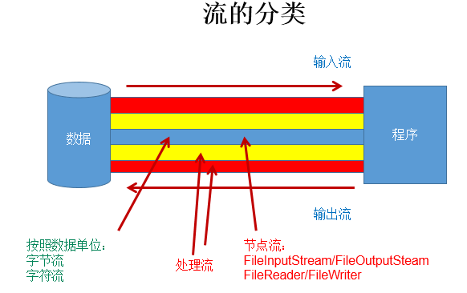
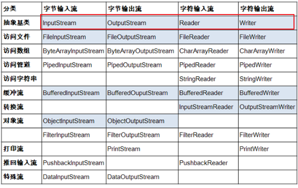

# 1.流的分类
* 1.操作数据单位：字节流、字符流
* 2.数据的流向：输入流、输出流
* 3.流的角色：节点流、处理流

**图示：**

# 2.流的体系结构

说明：红框对应的是IO流中的4个抽象基类。

蓝框的流需要大家重点关注。

# 3.重点说明的几个流结构

# 4.输入、输出的标准化过程
## 4.1 输入过程
① 创建File类的对象，指明读取的数据的来源。（要求此文件一定要存在）

② 创建相应的输入流，将File类的对象作为参数，传入流的构造器中

③ 具体的读入过程：
    创建相应的byte[] 或 char[]。
    
④ 关闭流资源

**说明：程序中出现的异常需要使用try-catch-finally处理。**

## 4.2 输出过程

① 创建File类的对象，指明写出的数据的位置。（不要求此文件一定要存在）

② 创建相应的输出流，将File类的对象作为参数，传入流的构造器中

③ 具体的写出过程：
    write(char[]/byte[] buffer,0,len)
    
④ 关闭流资源

**说明：程序中出现的异常需要使用try-catch-finally处理。**
