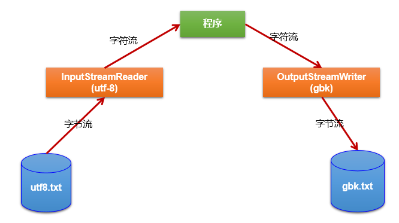

# 1.转换流涉及到的类：属于字符流

**InputStreamReader**：将一个字节的输入流转换为字符的输入流

**解码**：字节、字节数组  --->字符数组、字符串

**OutputStreamWriter**：将一个字符的输出流转换为字节的输出流

**编码**：字符数组、字符串 ---> 字节、字节数组

**说明：编码决定了解码的方式**


# 2.作用：提供字节流与字符流之间的转换

# 3.图示：


# 4.典型实现：
```java
@Test
    public void test1() throws IOException {

        FileInputStream fis = new FileInputStream("dbcp.txt");
//        InputStreamReader isr = new InputStreamReader(fis);//使用系统默认的字符集
        //参数2指明了字符集，具体使用哪个字符集，取决于文件dbcp.txt保存时使用的字符集
        InputStreamReader isr = new InputStreamReader(fis,"UTF-8");//使用系统默认的字符集

        char[] cbuf = new char[20];
        int len;
        while((len = isr.read(cbuf)) != -1){
            String str = new String(cbuf,0,len);
            System.out.print(str);
        }

        isr.close();

    }


```java
此时处理异常的话，仍然应该使用try-catch-finally

综合使用InputStreamReader和OutputStreamWriter
```java
@Test
public void test2() throws Exception {
    //1.造文件、造流
    File file1 = new File("dbcp.txt");
    File file2 = new File("dbcp_gbk.txt");

    FileInputStream fis = new FileInputStream(file1);
    FileOutputStream fos = new FileOutputStream(file2);

    InputStreamReader isr = new InputStreamReader(fis,"utf-8");
    OutputStreamWriter osw = new OutputStreamWriter(fos,"gbk");

    //2.读写过程
    char[] cbuf = new char[20];
    int len;
    while((len = isr.read(cbuf)) != -1){
        osw.write(cbuf,0,len);
    }

    //3.关闭资源
    isr.close();
    osw.close();


}
```
# 5.说明：
文件编码的方式（比如：GBK），决定了解析时使用的字符集（也只能是GBK）。

