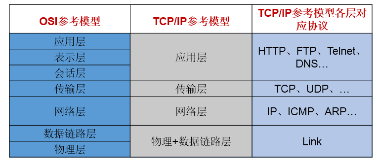
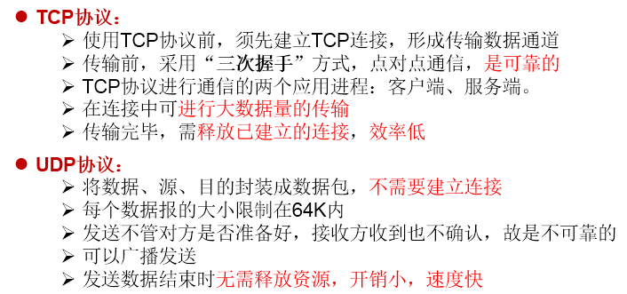
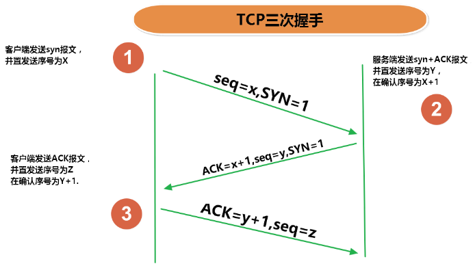
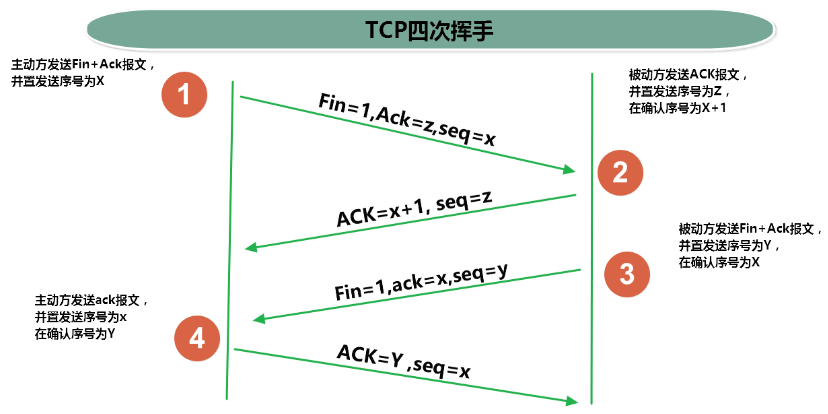

# 一、实现网络通信需要解决的两个问题
* 1.如何准确地定位网络上一台或多台主机；定位主机上的特定的应用
* 2.找到主机后如何可靠高效地进行数据传输


# 二、网络通信的两个要素：

* 1.对应问题一：IP和端口号
* 2.对应问题二：提供网络通信协议：TCP/IP参考模型（应用层、传输层、网络层、物理+数据链路层）


# 三、通信要素一：IP和端口号
## 1.IP的理解
* 1.IP:唯一的标识 Internet 上的计算机（通信实体）
* 2.在Java中使用InetAddress类代表IP
* 3.IP分类：IPv4 和 IPv6 ; 万维网 和 局域网
* 4.域名:   www.baidu.com   www.mi.com  www.sina.com  www.jd.com
*           
     域名解析：域名容易记忆，当在连接网络时输入一个主机的域名后，域名服务器(DNS)负责将域名转化成IP地址，这样才能和主机建立连接。 -------域名解析
* 5.本地回路地址：127.0.0.1 对应着：localhost


## 2.InetAddress类:此类的一个对象就代表着一个具体的IP地址
### 2.1实例化
```java
getByName(String host) 、 getLocalHost()
```
### 2.2常用方法
```java
getHostName() / getHostAddress()
```
## 3.端口号：正在计算机上运行的进程。
* 要求：不同的进程不同的端口号
* 范围：被规定为一个 16 位的整数 0~65535。

**端口号与IP地址的组合得出一个网络套接字：Socket**

# 四、通信要素二：网络通信协议
## 1. 分型模型

## 2.TCP和UDP的区别

## 3.TCP三次握手和四次挥手






