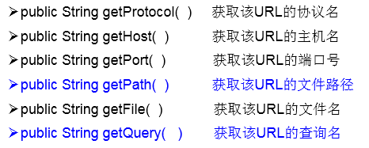

# 1.URL(Uniform Resource Locator)的理解:
**统一资源定位符，对应着互联网的某一资源地址**

# 2.URL的5个基本结构：
*  http://localhost:8080/examples/beauty.jpg?username=Tom
*  协议   主机名    端口号  资源地址           参数列表
# 3.如何实例化:
```java
URL url = new URL("http://localhost:8080/examples/beauty.jpg?username=Tom");
```
# 4.常用方法：


# 5.可以读取、下载对应的url资源：

```java
public static void main(String[] args) {

    HttpURLConnection urlConnection = null;
    InputStream is = null;
    FileOutputStream fos = null;
    try {
        URL url = new URL("http://localhost:8080/examples/beauty.jpg");

        urlConnection = (HttpURLConnection) url.openConnection();

        urlConnection.connect();

        is = urlConnection.getInputStream();
        fos = new FileOutputStream("day10\\beauty3.jpg");

        byte[] buffer = new byte[1024];
        int len;
        while((len = is.read(buffer)) != -1){
            fos.write(buffer,0,len);
        }

        System.out.println("下载完成");
    } catch (IOException e) {
        e.printStackTrace();
    } finally {
        //关闭资源
        if(is != null){
            try {
                is.close();
            } catch (IOException e) {
                e.printStackTrace();
            }
        }
        if(fos != null){
            try {
                fos.close();
            } catch (IOException e) {
                e.printStackTrace();
            }
        }
        if(urlConnection != null){
            urlConnection.disconnect();
        }
    }
}
```


