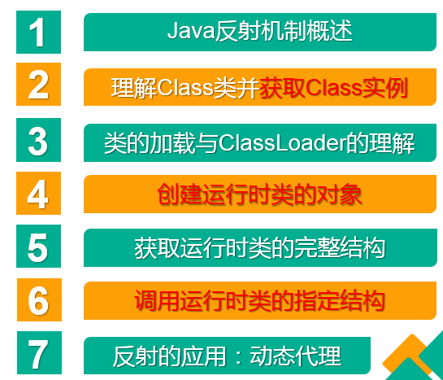
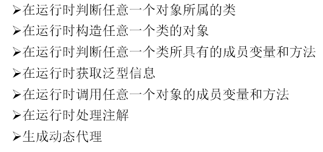

# 1.本章的主要内容



# 2.关于反射的理解

Reflection（反射)是被视为动态语言的关键，反射机制允许程序在执行期借助于Reflection API取得任何
类的内部信息，并能直接操作任意对象的内部属性及方法。

框架 = 反射 + 注解 + 设计模式。

# 3.体会反射机制的“动态性”
```java
//体会反射的动态性
@Test
public void test2(){

    for(int i = 0;i < 100;i++){
        int num = new Random().nextInt(3);//0,1,2
        String classPath = "";
        switch(num){
            case 0:
                classPath = "java.util.Date";
                break;
            case 1:
                classPath = "java.lang.Object";
                break;
            case 2:
                classPath = "com.atguigu.java.Person";
                break;
        }

        try {
            Object obj = getInstance(classPath);
            System.out.println(obj);
        } catch (Exception e) {
            e.printStackTrace();
        }
    }


}
```
```java
/*
创建一个指定类的对象。
classPath:指定类的全类名
 */
public Object getInstance(String classPath) throws Exception {
   Class clazz =  Class.forName(classPath);
   return clazz.newInstance();
}

```
# 4.反射机制能提供的功能



# 5.相关API

    java.lang.Class:反射的源头
    java.lang.reflect.Method
    java.lang.reflect.Field
    java.lang.reflect.Constructor
    ....


