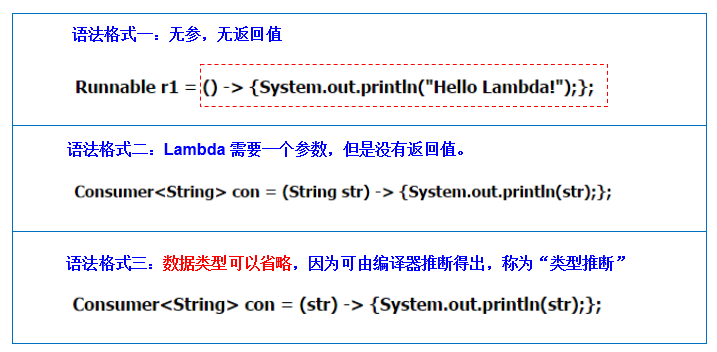

# 1.Lambda表达式使用前后的对比：
**举例一：**
```java
@Test
public void test1(){

    Runnable r1 = new Runnable() {
        @Override
        public void run() {
            System.out.println("我爱北京天安门");
        }
    };

    r1.run();

    System.out.println("***********************");

    Runnable r2 = () -> System.out.println("我爱北京故宫");

    r2.run();
}
```
**举例二：**
```java
@Test
public void test2(){

    Comparator<Integer> com1 = new Comparator<Integer>() {
        @Override
        public int compare(Integer o1, Integer o2) {
            return Integer.compare(o1,o2);
        }
    };

    int compare1 = com1.compare(12,21);
    System.out.println(compare1);

    System.out.println("***********************");
    //Lambda表达式的写法
    Comparator<Integer> com2 = (o1,o2) -> Integer.compare(o1,o2);

    int compare2 = com2.compare(32,21);
    System.out.println(compare2);


    System.out.println("***********************");
    //方法引用
    Comparator<Integer> com3 = Integer :: compare;

    int compare3 = com3.compare(32,21);
    System.out.println(compare3);
}
```
# 2.Lambda表达式的基本语法：
* 1.举例： (o1,o2) -> Integer.compare(o1,o2);


* 2.格式：


      > :lambda操作符 或 箭头操作符
      >左边：lambda形参列表 （其实就是接口中的抽象方法的形参列表
      >右边：lambda体 （其实就是重写的抽象方法的方法体

# 3.如何使用：分为六种情况




**总结六种情况：**
>左边：lambda形参列表的参数类型可以省略(类型推断)；如果lambda形参列表只一个参数，其一对()也可以省略
>
>右边：lambda体应该使用一对{}包裹；如果lambda体只一条执行语句（可能是return语句，省略这一对{}和return关键字


**Lambda表达式的省略写法(进一步在Lambda表达式的基础上继续简化)**
- 参数类型可以省略不写。
- 如果只有一-个参数，参数类型可以省略，同时()也可以省略。
- 如果Lambda表达式的方 法体代码只有一行代码。可以省略大括号不写,同时要省略分号!
- 如果Lambda表达式的方法体代码只有一行代码。可以省略大括号不写。此时，如果这行代码是return
语句，必须省略return不写，同时也必须省略";"不写。


