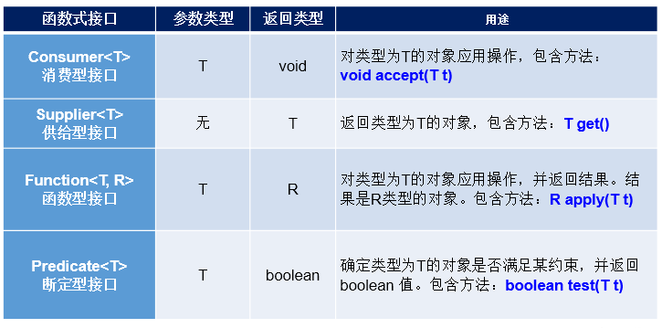

# 1.函数式接口的使用说明
> 如果一个接口中，只声明了一个抽象方法，则此接口就称为函数式接口。
> 
> 我们可以在一个接口上使用 @FunctionalInterface 注解，这样做可以检查它是否是一个函数式接口。
> 
> Lambda表达式的本质：作为函数式接口的实例

# 2.Java8中关于Lambda表达式提供的4个基本的函数式接口：
具体使用：

# 3.总结
## 3.1 何时使用lambda表达式？
当需要对一个函数式接口实例化的时候，可以使用lambda表达式。
## 3.2 何时使用给定的函数式接口？
如果我们开发中需要定义一个函数式接口，首先看看在已有的jdk提供的函数式接口是否提供了能满足需求的函数式接口。如果有，则直接调用即可，不需要自己再自定义了。

