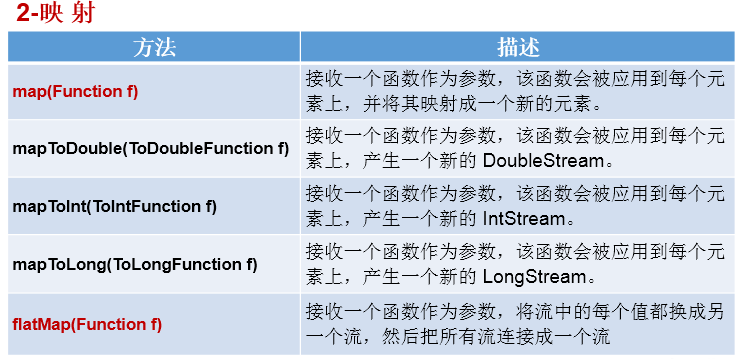
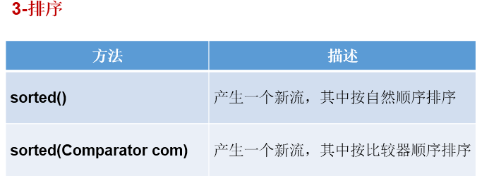
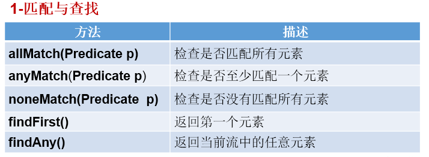
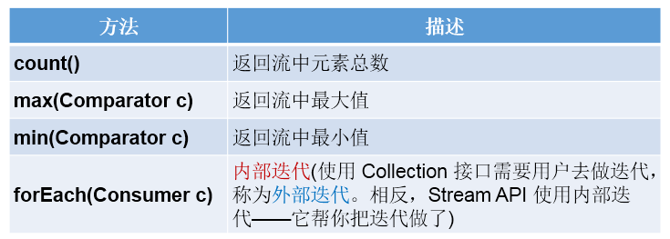
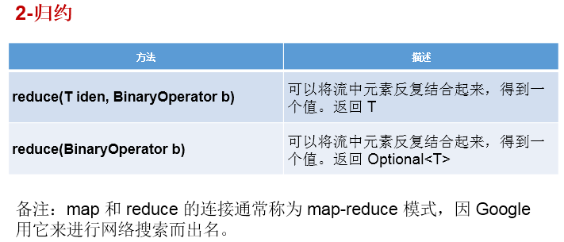
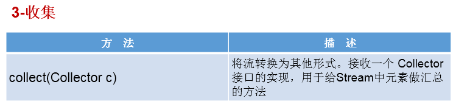
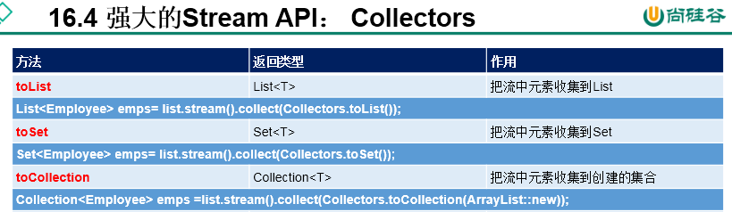

# 1.Stream API的理解：
* 1.1 Stream关注的是对数据的运算，与CPU打交道
集合关注的是数据的存储，与内存打交道

* 1.2 java8提供了一套api,使用这套api可以对内存中的数据进行过滤、排序、映射、归约等操作。类似于sql对数据库中表的相关操作。


# 2.注意点：
* ①Stream 自己不会存储元素。
* ②Stream 不会改变源对象。相反，他们会返回一个持有结果的新Stream。
* ③Stream 操作是延迟执行的。这意味着他们会等到需要结果的时候才执行。

# 3.Stream的使用流程：
* ① Stream的实例化
* ② 一系列的中间操作（过滤、映射、...)
* ③ 终止操作

# 4.使用流程的注意点：
* 4.1 一个中间操作链，对数据源的数据进行处理
* 4.2 一旦执行终止操作，就执行中间操作链，并产生结果。之后，不会再被使用

# 5.步骤一：Stream实例化
```java
//创建 Stream方式一：通过集合
    @Test
    public void test1(){
        List<Employee> employees = EmployeeData.getEmployees();

//        default Stream<E> stream() : 返回一个顺序流
        Stream<Employee> stream = employees.stream();

//        default Stream<E> parallelStream() : 返回一个并行流
        Stream<Employee> parallelStream = employees.parallelStream();

    }

    //创建 Stream方式二：通过数组
    @Test
    public void test2(){
        int[] arr = new int[]{1,2,3,4,5,6};
        //调用Arrays类的static <T> Stream<T> stream(T[] array): 返回一个流
        IntStream stream = Arrays.stream(arr);

        Employee e1 = new Employee(1001,"Tom");
        Employee e2 = new Employee(1002,"Jerry");
        Employee[] arr1 = new Employee[]{e1,e2};
        Stream<Employee> stream1 = Arrays.stream(arr1);

    }
    //创建 Stream方式三：通过Stream的of()
    @Test
    public void test3(){

        Stream<Integer> stream = Stream.of(1, 2, 3, 4, 5, 6);

    }

    //创建 Stream方式四：创建无限流
    @Test
    public void test4(){

//      迭代
//      public static<T> Stream<T> iterate(final T seed, final UnaryOperator<T> f)
        //遍历前10个偶数
        Stream.iterate(0, t -> t + 2).limit(10).forEach(System.out::println);


//      生成
//      public static<T> Stream<T> generate(Supplier<T> s)
        Stream.generate(Math::random).limit(10).forEach(System.out::println);

    }
```
# 6.步骤二：中间操作





# 7.步骤三：终止操作










**Collector需要使用Collectors提供实例。**




