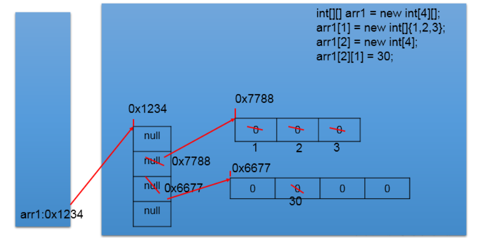

# 二维数组
## 1.如何理解二维数组？
数组属于引用数据类型

数组的元素也可以是引用数据类型
一个一维数组A的元素如果还是一个一维数组类型的，则，此数组A称为二维数组。


## 2.二维数组的声明与初始化  

正确的方式：


```java
  int[] arr = new int[]{1,2,3};//一维数组
  //静态初始化
  int[][] arr1 = new int[][]{{1,2,3},{4,5},{6,7,8}};
  //动态初始化1
  String[][] arr2 = new String[3][2];
  //动态初始化2
  String[][] arr3 = new String[3][];
  //也是正确的写法：
  int[] arr4[] = new int[][]{{1,2,3},{4,5,9,10},{6,7,8}};
  int[] arr5[] = {{1,2,3},{4,5},{6,7,8}};//类型推断
    
```


错误的方式：
```java
  String[][] arr4 = new String[][4];
  String[4][3] arr5 = new String[][];
  int[][] arr6 = new int[4][3]{{1,2,3},{4,5},{6,7,8}};

```

## 3.如何调用二维数组元素:
```java
  System.out.println(arr1[0][1]);//2
  System.out.println(arr2[1][1]);//null

  arr3[1] = new String[4];
  System.out.println(arr3[1][0]);
  System.out.println(arr3[0]);//
  
```

## 4.二维数组的属性：
```java
  System.out.println(arr4.length);//3
  System.out.println(arr4[0].length);//3
  System.out.println(arr4[1].length);//4
```

## 5.遍历二维数组元素
```java
  for(int i = 0;i < arr4.length;i++){

    for(int j = 0;j < arr4[i].length;j++){
    System.out.print(arr4[i][j] + "  ");
    }
  System.out.println();
}
```		  


## 6.二维数组元素的默认初始化值
+ 规定：二维数组分为外层数组的元素，内层数组的元素

  ```int[][] arr = new int[4][3];```
  
  ```外层元素：arr[0],arr[1]等```
  
  ```内层元素：arr[0][0],arr[1][2]等```

+ 数组元素的默认初始化值 
针对于初始化方式一：

  ```比如：int[][] arr = new int[4][3];```

  ```外层元素的初始化值为：地址值```

  ```内层元素的初始化值为：与一维数组初始化情况相同```

+ 针对于初始化方式二：

  ```比如：int[][] arr = new int[4][];```

  ```外层元素的初始化值为：null```

  ```内层元素的初始化值为：不能调用，否则报错。```
  
## 7.二维数组的内存结构


