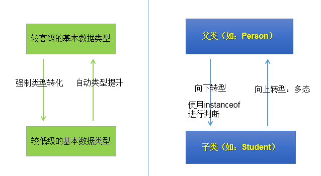

# 面向对象的特征三：多态性

## 1.多态性的理解：可以理解为一个事物的多种形态。
## 2.何为多态性：
>对象的多态性：父类的引用指向子类的对象（或子类的对象赋给父类的引用）


**举例：**
```java
Person p = new Man();
Object obj = new Date();
```
## 3.多态性的使用：虚拟方法调用
> 有了对象的多态性以后，我们在编译期，只能调用父类中声明的方法，但在运行期，我们实际执行的是子类重写父类的方法。
> 
> 总结：编译，看左边；运行，看右边。


## 4.多态性的使用前提：
① 类的继承关系  
② 方法的重写
## 5.多态性的应用举例：

**举例一：**
```java
public void func(Animal animal){//Animal animal = new Dog();
  animal.eat();
  animal.shout();
}
```
**举例二：**
```java
public void method(Object obj){

}
```

**举例三：**
```java
class Driver{

  public void doData(Connection conn){//conn = new MySQlConnection(); / conn = new OracleConnection();
  //规范的步骤去操作数据
  //		conn.method1();
  //		conn.method2();
  //		conn.method3();

  }

}
```
## 6.多态性使用的注意点：

* **对象的多态性，只适用于方法，不适用于属性（编译和运行都看左边）**

************************************************************
## 7.关于向上转型与向下转型：


**7.1 向上转型：多态**

**7.2 向下转型：**

**7.2.1 为什么使用向下转型：**

>有了对象的多态性以后，内存中实际上是加载了子类特有的属性和方法的，但是由于变量声明为父类类型，导致编译时，只能调用父类中声明的属性和方法。子类特有的属性和方法不能调用。如何才能调用子类特的属性和方法？使用向下转型。


**7.2.2 如何实现向下转型：**

>使用强制类型转换符：()


**7.2.3 使用时的注意点：**

>① 使用强转时，可能出现ClassCastException的异常。
>
>② 为了避免在向下转型时出现ClassCastException的异常，我们在向下转型之前，先进行instanceof的判断，一旦返回true，就进行向下转型。如果返回false，不进行向下转型。


**7.2.4 instanceof的使用：**

>① a instanceof A:判断对象a是否是类A的实例。如果是，返回true；如果不是，返回false。
>
>② 如果 a instanceof A返回true,则 a instanceof B也返回true.其中，类B是类A的父类。
>
>③ 要求a所属的类与类A必须是子类和父类的关系，否则编译错误。

**7.2.5 图示：**




