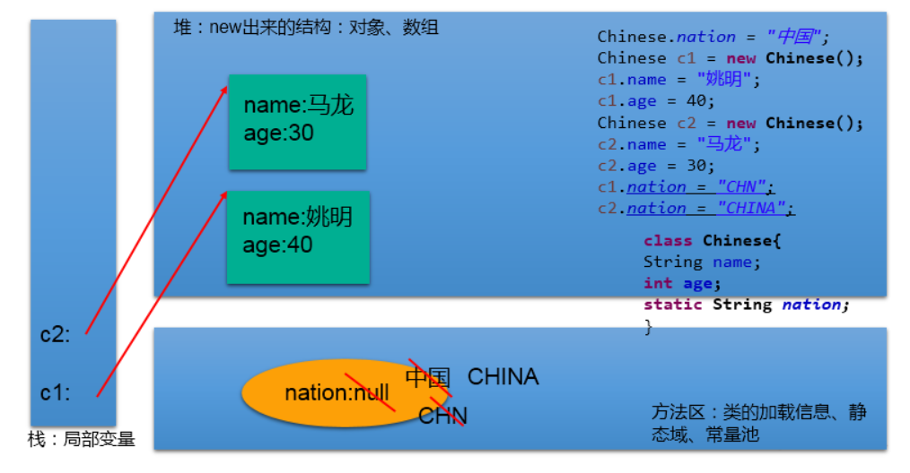

# static:静态的
## 1.可以用来修饰的结构：主要用来修饰类的内部结构

>属性、方法、代码块、内部类
>
## 2.static修饰属性：静态变量（或类变量）
* **2.1 属性，是否使用static修饰，又分为：静态属性  vs 非静态属性(实例变量)**

  >实例变量：我们创建了类的多个对象，每个对象都独立的拥一套类中的非静态属性。当修改其中一个对象中的非静态属性时，不会导致其他对象中同样的属性值的修改。


  >静态变量：我们创建了类的多个对象，多个对象共享同一个静态变量。当通过某一个对象修改静态变量时，会导致其他对象调用此静态变量时，是修改过了的。


* **2.2 static修饰属性的其他说明：**


  >① 静态变量随着类的加载而加载。可以通过"类.静态变量"的方式进行调用
  >
  >② 静态变量的加载要早于对象的创建。
  >
  >③ 由于类只会加载一次，则静态变量在内存中也只会存在一份：存在方法区的静态域中。
  >
  >④


    ||类变量|实例变量|
    |:-:|:-:|:-:|
    |类|yes|no|
    |对象|yes|yes|

* **2.3 静态属性举例：System.out; Math.PI;**

## 3.静态变量内存解析：



## 4.static修饰方法：静态方法、类方法
① 随着类的加载而加载，可以通过"类.静态方法"的方式进行调用

②

||静态方法|非静态方法|
|:-:|:-:|:-:|
|类|yes|no|
|对象|yes|yes|

③ 静态方法中，只能调用静态的方法或属性
非静态方法中，既可以调用非静态的方法或属性，也可以调用静态的方法或属性

## 5. static的注意点：

* **5.1 在静态的方法内，不能使用this关键字、super关键字**


* **5.2 关于静态属性和静态方法的使用，大家都从生命周期的角度去理解。**

## 6.如何判定属性和方法应该使用static关键字：

* **6.1 关于属性**


  > 属性是可以被多个对象所共享的，不会随着对象的不同而不同的。
  > 
  > 类中的常量也常常声明为static

* **6.2 关于方法**


  > 操作静态属性的方法，通常设置为static的
  > 
  > 工具类中的方法，习惯上声明为static的。 比如：Math、Arrays、Collections


## 7.使用举例：
* 举例一：Arrays、Math、Collections等工具类
* 举例二：单例模式
* 举例三：

```java
class Circle{
	
	private double radius;
	private int id;//自动赋值
	
	public Circle(){
		id = init++;
		total++;
	}
	
	public Circle(double radius){
		this();
//		id = init++;
//		total++;
		this.radius = radius;
		
	}
	
	private static int total;//记录创建的圆的个数
	private static int init = 1001;//static声明的属性被所对象所共享
	
	public double findArea(){
		return 3.14 * radius * radius;
	}

	public double getRadius() {
		return radius;
	}

	public void setRadius(double radius) {
		this.radius = radius;
	}

	public int getId() {
		return id;
	}

	public static int getTotal() {
		return total;
	}

}
```


