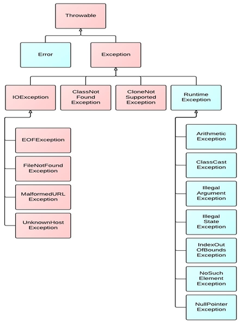

# 1. 异常的体系结构

  java.lang.Throwable
  
  		|-----java.lang.Error:一般不编写针对性的代码进行处理。
      
  		|-----java.lang.Exception:可以进行异常的处理
      
  			|------编译时异常(checked)
        
  					|-----IOException
  						|-----FileNotFoundException
  					|-----ClassNotFoundException
  			|------运行时异常(unchecked,RuntimeException)
  					|-----NullPointerException
  					|-----ArrayIndexOutOfBoundsException
  					|-----ClassCastException
  					|-----NumberFormatException
  					|-----InputMismatchException
  					|-----ArithmeticException



# 2.从程序执行过程，看编译时异常和运行时异常


  >编译时异常：执行javac.exe命名时，可能出现的异常
  >
  >运行时异常：执行java.exe命名时，出现的异常

# 3.常见的异常类型，请举例说明：

```java
//******************以下是运行时异常***************************
	//ArithmeticException
	@Test
	public void test6(){
		int a = 10;
		int b = 0;
		System.out.println(a / b);
	}
	
	//InputMismatchException
	@Test
	public void test5(){
		Scanner scanner = new Scanner(System.in);
		int score = scanner.nextInt();
		System.out.println(score);
		
		scanner.close();
	}
	
	//NumberFormatException
	@Test
	public void test4(){
		
		String str = "123";
		str = "abc";
		int num = Integer.parseInt(str);
		
		
		
	}
	
	//ClassCastException
	@Test
	public void test3(){
		Object obj = new Date();
		String str = (String)obj;
	}
	
	//IndexOutOfBoundsException
	@Test
	public void test2(){
		//ArrayIndexOutOfBoundsException
//		int[] arr = new int[10];
//		System.out.println(arr[10]);
		//StringIndexOutOfBoundsException
		String str = "abc";
		System.out.println(str.charAt(3));
	}
	
	//NullPointerException
	@Test
	public void test1(){
		
//		int[] arr = null;
//		System.out.println(arr[3]);
		
		String str = "abc";
		str = null;
		System.out.println(str.charAt(0));
		
	}

	//******************以下是编译时异常***************************
	@Test
	public void test7(){
//		File file = new File("hello.txt");
//		FileInputStream fis = new FileInputStream(file);
//		
//		int data = fis.read();
//		while(data != -1){
//			System.out.print((char)data);
//			data = fis.read();
//		}
//		
//		fis.close();
		
	}
```
