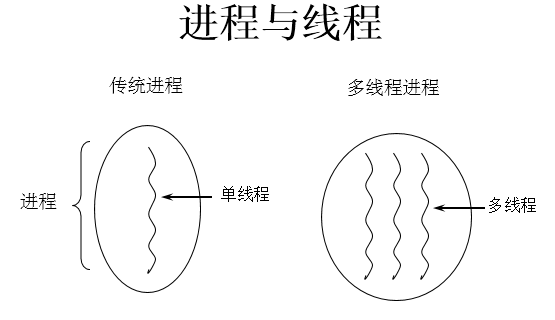

## 1. 程序(programm)
  >概念：是为完成特定任务、用某种语言编写的一组指令的集合。即指一段静态的代码。

## 2. 进程(process)
  >概念：程序的一次执行过程，或是正在运行的一个程序。

  >说明：进程作为资源分配的单位，系统在运行时会为每个进程分配不同的内存区域

## 3. 线程(thread)
  >概念：进程可进一步细化为线程，是一个程序内部的一条执行路径。

  >说明：线程作为调度和执行的单位，每个线程拥独立的运行栈和程序计数器(pc)，线程切换的开销小。

## 补充：
**内存结构：**

* 进程可以细化为多个线程。

* 每个线程，拥有自己独立的：栈、程序计数器

* 多个线程，共享同一个进程中的结构：方法区、堆。

