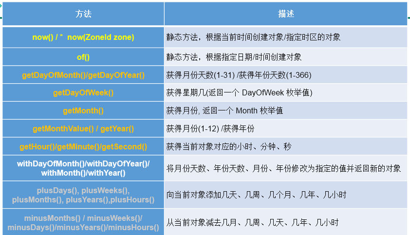
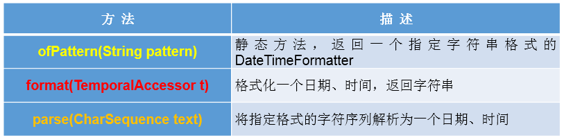
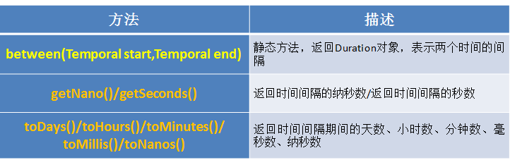

# JDK8中新日期时间API

## 1.日期时间API的迭代：
`第一代：jdk 1.0 Date类`

`第二代：jdk 1.1 Calendar类，一定程度上替换Date类`

`第三代：jdk 1.8 提出了新的一套API`

## 2.前两代存在的问题举例：

>可变性：像日期和时间这样的类应该是不可变的。

>偏移性：Date中的年份是从1900开始的，而月份都从0开始。

>格式化：格式化只对Date用，Calendar则不行。

>此外，它们也不是线程安全的；不能处理闰秒等。

## 3.java 8 中新的日期时间API涉及到的包

## 4.本地日期、本地时间、本地日期时间的使用：LocalDate / LocalTime / LocalDateTime
### 4.1 说明：

>① 分别表示使用 ISO-8601日历系统的日期、时间、日期和时间。它们提供了简单的本地日期或时间，并不包含当前的时间信息，也不包含与时区相关的信息。

>② LocalDateTime相较于LocalDate、LocalTime，使用频率要高

>③ 类似于Calendar

### 4.2 常用方法：



## 5.时间点：Instant
### 5.1 说明：
>① 时间线上的一个瞬时点。 概念上讲，它只是简单的表示自1970年1月1日0时0分0秒（UTC开始的秒数。）

>② 类似于 java.util.Date类

### 5.2 常用方法：


## 6.日期时间格式化类：DateTimeFormatter
### 6.1 说明：
>① 格式化或解析日期、时间

>② 类似于SimpleDateFormat
### 6.2 常用方法：


* ① 实例化方式：


  >预定义的标准格式。如：ISO_LOCAL_DATE_TIME;ISO_LOCAL_DATE;ISO_LOCAL_TIME
  >
  >本地化相关的格式。如：ofLocalizedDateTime(FormatStyle.LONG)
  >
  >自定义的格式。如：ofPattern(“yyyy-MM-dd hh:mm:ss”)

* ② 常用方法：




  >特别的：自定义的格式。如：ofPattern(“yyyy-MM-dd hh:mm:ss”)


  >重点：自定义的格式。如：ofPattern(“yyyy-MM-dd hh:mm:ss”)

```java
DateTimeFormatter formatter3 = DateTimeFormatter.ofPattern("yyyy-MM-dd hh:mm:ss");
//格式化
String str4 = formatter3.format(LocalDateTime.now());
System.out.println(str4);//2019-02-18 03:52:09

//解析
TemporalAccessor accessor = formatter3.parse("2019-02-18 03:52:09");
System.out.println(accessor);
```
## 7.其它API的使用 
### 7.1 带时区的日期时间：ZonedDateTime / ZoneId 
举例：
```java
// ZoneId:类中包含了所的时区信息
	@Test
	public void test1(){
		//getAvailableZoneIds():获取所的ZoneId
		Set<String> zoneIds = ZoneId.getAvailableZoneIds();
		for(String s : zoneIds){
			System.out.println(s);
		}
		System.out.println();
		
		//获取“Asia/Tokyo”时区对应的时间
		LocalDateTime localDateTime = LocalDateTime.now(ZoneId.of("Asia/Tokyo"));
		System.out.println(localDateTime);
		
		
	}
//ZonedDateTime:带时区的日期时间
	@Test
	public void test2(){
		//now():获取本时区的ZonedDateTime对象
		ZonedDateTime zonedDateTime = ZonedDateTime.now();
		System.out.println(zonedDateTime);
		//now(ZoneId id):获取指定时区的ZonedDateTime对象
		ZonedDateTime zonedDateTime1 = ZonedDateTime.now(ZoneId.of("Asia/Tokyo"));
		System.out.println(zonedDateTime1);
	}
```
### 7.2 时间间隔：Duration--用于计算两个“时间”间隔，以秒和纳秒为基准


举例：
```java
@Test
	public void test3(){
		LocalTime localTime = LocalTime.now();
		LocalTime localTime1 = LocalTime.of(15, 23, 32);
		//between():静态方法，返回Duration对象，表示两个时间的间隔
		Duration duration = Duration.between(localTime1, localTime);
		System.out.println(duration);
		
		System.out.println(duration.getSeconds());
		System.out.println(duration.getNano());
		
		LocalDateTime localDateTime = LocalDateTime.of(2016, 6, 12, 15, 23, 32);
		LocalDateTime localDateTime1 = LocalDateTime.of(2017, 6, 12, 15, 23, 32);
		
		Duration duration1 = Duration.between(localDateTime1, localDateTime);
		System.out.println(duration1.toDays());
		
	}
```
### 7.3 日期间隔：Period --用于计算两个“日期”间隔，以年、月、日衡量




举例：
```java
	@Test
	public void test4(){
		LocalDate localDate = LocalDate.now();
		LocalDate localDate1 = LocalDate.of(2028, 3, 18);
		
		Period period = Period.between(localDate, localDate1);
		System.out.println(period);
		
		System.out.println(period.getYears());
		System.out.println(period.getMonths());
		System.out.println(period.getDays());
		
		Period period1 = period.withYears(2);
		System.out.println(period1);
		
	}
```
### 7.4 日期时间校正器：TemporalAdjuster
举例：
```java
	@Test
	public void test5(){
		//获取当前日期的下一个周日是哪天？
		TemporalAdjuster temporalAdjuster = TemporalAdjusters.next(DayOfWeek.SUNDAY);
		
		LocalDateTime localDateTime = LocalDateTime.now().with(temporalAdjuster);
		System.out.println(localDateTime);
		
		//获取下一个工作日是哪天？
		LocalDate localDate = LocalDate.now().with(new TemporalAdjuster(){

			@Override
			public Temporal adjustInto(Temporal temporal) {
				LocalDate date = (LocalDate)temporal;
				if(date.getDayOfWeek().equals(DayOfWeek.FRIDAY)){
					return date.plusDays(3);
				}else if(date.getDayOfWeek().equals(DayOfWeek.SATURDAY)){
					return date.plusDays(2);
				}else{
					return date.plusDays(1);
				}
					
			}
			
		});
		
		System.out.println("下一个工作日是：" + localDate);
	}

```


