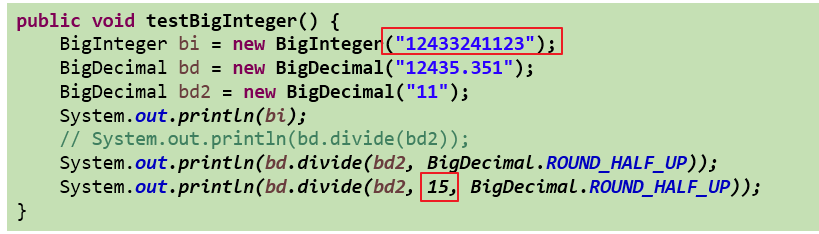

# 1.System类
  >System类代表系统，系统级的很多属性和控制方法都放置在该类的内部。该类位于java.lang包。

  >由于该类的构造器是private的，所以无法创建该类的对象，也就是无法实例化该类。其内部的成员变量和成员方法都是static的，所以也可以很方便的进行调用。

**方法：**
```java
native long currentTimeMillis()
void exit(int status)
void gc()
String getProperty(String key)
```
# 2.Math类
  >java.lang.Math提供了一系列静态方法用于科学计算。其方法的参数和返回值类型一般为double型。

# 3.BigInteger类、BigDecimal类
**说明：**
  >① java.math包的BigInteger可以表示不可变的任意精度的整数。

  >② 要求数字精度比较高，用到java.math.BigDecimal类

代码举例：



