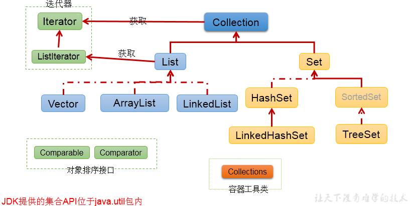

# Collection接口
## 1.单列集合框架结构
    |----Collection接口：单列集合，用来存储一个一个的对象
             |----List接口：存储序的、可重复的数据。  -->“动态”数组
                   |----ArrayList、LinkedList、Vector

             |----Set接口：存储无序的、不可重复的数据   -->高中讲的“集合”
                   |----HashSet、LinkedHashSet、TreeSet


对应图示：



## 2.Collection接口常用方法：

`add(Object obj)`, `addAll(Collection coll)`, `size()`, `isEmpty()`, `clear()`;


`contains(Object obj)`, `containsAll(Collection coll)`, `remove(Object obj)`, `removeAll(Collection coll)`, `retainsAll(Collection coll)`, `equals(Object obj)`;


`hasCode()`, `toArray() , `iterator()`;

## 3.Collection集合与数组间的转换
```java
//集合 --->数组：toArray()
Object[] arr = coll.toArray();
for(int i = 0;i < arr.length;i++){
    System.out.println(arr[i]);
}
```

```java
//拓展：数组 --->集合:调用Arrays类的静态方法asList(T ... t)
List<String> list = Arrays.asList(new String[]{"AA", "BB", "CC"});
System.out.println(list);

List arr1 = Arrays.asList(new int[]{123, 456});
System.out.println(arr1.size());//1

List arr2 = Arrays.asList(new Integer[]{123, 456});
System.out.println(arr2.size());//2
```
## 4.使用Collection集合存储对象，要求对象所属的类满足：
**向Collection接口的实现类的对象中添加数据obj时，要求obj所在类要重写equals().**

## 5.本章节要求：
  
**层次一：选择合适的集合类去实现数据的保存，调用其内部的相关方法。**
   
**层次二：不同的集合类底层的数据结构为何？如何实现数据的操作的：增删改查等。**
