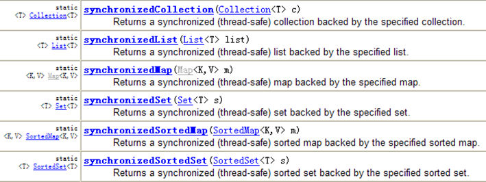

# Collections工具类
## 1.作用：操作Collection和Map的工具类
## 2.常用方法：
>reverse(List)：反转 List 中元素的顺序

>shuffle(List)：对 List 集合元素进行随机排序

>sort(List)：根据元素的自然顺序对指定 List 集合元素升序排序

>sort(List，Comparator)：根据指定的 Comparator 产生的顺序对 List 集合元素进行排序

>swap(List，int， int)：将指定 list 集合中的 i 处元素和 j 处元素进行交换

>Object max(Collection)：根据元素的自然顺序，返回给定集合中的最大元素

>Object max(Collection，Comparator)：根据 Comparator 指定的顺序，返回给定集合中的最大元素

>Object min(Collection)

>Object min(Collection，Comparator)

>int frequency(Collection，Object)：返回指定集合中指定元素的出现次数

>void copy(List dest,List src)：将src中的内容复制到dest中

>boolean replaceAll(List list，Object oldVal，Object newVal)：使用新值替换 List 对象的所旧值

**说明：ArrayList和HashMap都是线程不安全的，如果程序要求线程安全，我们可以将ArrayList、HashMap转换为线程的。**

**使用synchronizedList(List list） 和 synchronizedMap(Map map）**

